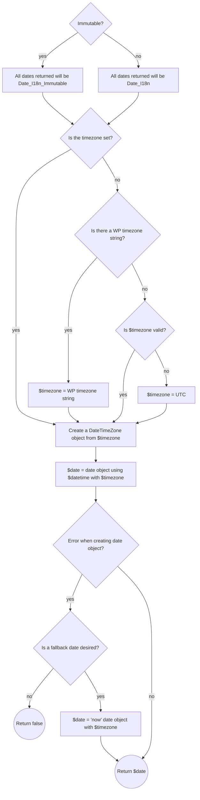

# StellarWP Dates

[](https://github.com/stellarwp/dates/actions?query=branch%3Amain) [](https://github.com/stellarwp/dates/actions/workflows/static-analysis.yml)

A collection of date utilities authored by the development team at [StellarWP](https://stellarwp.com) and provided free for the WordPress community.

_This work is forked from the battle-tested date handling done at [The Events Calendar](https://theeventscalendar.com)!_

## Installation

It's recommended that you install Dates as a project dependency via [Composer](https://getcomposer.org/):

```bash
composer require stellarwp/dates
```

> We _actually_ recommend that this library gets included in your project using [Strauss](https://github.com/BrianHenryIE/strauss).
>
> Luckily, adding Strauss to your `composer.json` is only slightly more complicated than adding a typical dependency, so checkout our [strauss docs](https://github.com/stellarwp/global-docs/blob/main/docs/strauss-setup.md).

## Documentation

* [How dates are built](#how-dates-are-built)
* [Constants](#constants)
* [Dates](/docs/classes/StellarWP/Dates/Dates.md)
  * [build_date_object](/docs/classes/StellarWP/Dates/Dates.md#build_date_object) - alias for `mutable()`
  * [build_localized_months](/docs/classes/StellarWP/Dates/Dates.md#build_localized_months)
  * [build_localized_weekdays](/docs/classes/StellarWP/Dates/Dates.md#build_localized_weekdays)
  * [catch_and_throw](/docs/classes/StellarWP/Dates/Dates.md#catch_and_throw)
  * [clear_cache](/docs/classes/StellarWP/Dates/Dates.md#clear_cache)
  * [date](/docs/classes/StellarWP/Dates/Dates.md#date) - alias for `date_only()`
  * [date_diff](/docs/classes/StellarWP/Dates/Dates.md#date_diff) - alias for `diff()`
  * [date_only](/docs/classes/StellarWP/Dates/Dates.md#date_only)
  * [datetime_from_format](/docs/classes/StellarWP/Dates/Dates.md#datetime_from_format)
  * [diff](/docs/classes/StellarWP/Dates/Dates.md#diff)
  * [first_day_in_month](/docs/classes/StellarWP/Dates/Dates.md#first_day_in_month)
  * [get](/docs/classes/StellarWP/Dates/Dates.md#get) - calls `immutable()` (default) or `mutable()`
  * [get_cache](/docs/classes/StellarWP/Dates/Dates.md#get_cache)
  * [get_first_day_of_week_in_month](/docs/classes/StellarWP/Dates/Dates.md#get_first_day_of_week_in_month)
  * [get_last_day_of_month](/docs/classes/StellarWP/Dates/Dates.md#get_last_day_of_month)
  * [get_last_day_of_week_in_month](/docs/classes/StellarWP/Dates/Dates.md#get_last_day_of_week_in_month)
  * [get_localized_months_full](/docs/classes/StellarWP/Dates/Dates.md#get_localized_months_full)
  * [get_localized_months_short](/docs/classes/StellarWP/Dates/Dates.md#get_localized_months_short)
  * [get_localized_weekdays_full](/docs/classes/StellarWP/Dates/Dates.md#get_localized_weekdays_full)
  * [get_localized_weekdays_initial](/docs/classes/StellarWP/Dates/Dates.md#get_localized_weekdays_initial)
  * [get_localized_weekdays_short](/docs/classes/StellarWP/Dates/Dates.md#get_localized_weekdays_short)
  * [get_modifier_from_offset](/docs/classes/StellarWP/Dates/Dates.md#get_modifier_from_offset)
  * [get_week_start_end](/docs/classes/StellarWP/Dates/Dates.md#get_week_start_end)
  * [get_weekday_timestamp](/docs/classes/StellarWP/Dates/Dates.md#get_weekday_timestamp)
  * [has_cache](/docs/classes/StellarWP/Dates/Dates.md#has_cache)
  * [hour](/docs/classes/StellarWP/Dates/Dates.md#hour) - alias for `hour_only()`
  * [hour_only](/docs/classes/StellarWP/Dates/Dates.md#hour_only)
  * [immutable](/docs/classes/StellarWP/Dates/Dates.md#immutable)
  * [interval](/docs/classes/StellarWP/Dates/Dates.md#interval)
  * [is_between](/docs/classes/StellarWP/Dates/Dates.md#is_date_between)
  * [is_now](/docs/classes/StellarWP/Dates/Dates.md#is_now) - calls `is_between()` with a different parameter order, where the date to look for is last and optional.
  * [is_timestamp](/docs/classes/StellarWP/Dates/Dates.md#is_timestamp)
  * [is_valid](/docs/classes/StellarWP/Dates/Dates.md#is_valid)
  * [is_valid_date](/docs/classes/StellarWP/Dates/Dates.md#is_valid_date) - alias for `is_valid()`
  * [is_weekday](/docs/classes/StellarWP/Dates/Dates.md#is_weekday)
  * [is_weekend](/docs/classes/StellarWP/Dates/Dates.md#is_weekend)
  * [last_day_in_month](/docs/classes/StellarWP/Dates/Dates.md#last_day_in_month)
  * [meridian](/docs/classes/StellarWP/Dates/Dates.md#meridian) - alias for `meridian_only()`
  * [meridian_only](/docs/classes/StellarWP/Dates/Dates.md#meridian_only)
  * [minutes](/docs/classes/StellarWP/Dates/Dates.md#minutes)
  * [minutes_only](/docs/classes/StellarWP/Dates/Dates.md#minutes_only)
  * [mutable](/docs/classes/StellarWP/Dates/Dates.md#mutable)
  * [number_to_ordinal](/docs/classes/StellarWP/Dates/Dates.md#number_to_ordinal)
  * [range_coincides](/docs/classes/StellarWP/Dates/Dates.md#range_coincides) - alias for `range_overlaps()`
  * [range_overlaps](/docs/classes/StellarWP/Dates/Dates.md#range_overlaps)
  * [reformat](/docs/classes/StellarWP/Dates/Dates.md#reformat)
  * [round_nearest_half_hour](/docs/classes/StellarWP/Dates/Dates.md#round_nearest_half_hour)
  * [seconds](/docs/classes/StellarWP/Dates/Dates.md#seconds) - alias for `seconds_only()`
  * [seconds_only](/docs/classes/StellarWP/Dates/Dates.md#seconds_only)
  * [set_cache](/docs/classes/StellarWP/Dates/Dates.md#set_cache)
  * [sort](/docs/classes/StellarWP/Dates/Dates.md#sort)
  * [time_between](/docs/classes/StellarWP/Dates/Dates.md#time_between)
  * [time](/docs/classes/StellarWP/Dates/Dates.md#time) - alias for `time_only()`
  * [time_only](/docs/classes/StellarWP/Dates/Dates.md#time_only)
  * [unescape_date_format](/docs/classes/StellarWP/Dates/Dates.md#unescape_date_format)
  * [week_ends_on](/docs/classes/StellarWP/Dates/Dates.md#week_ends_on)
  * [wp_strtotime](/docs/classes/StellarWP/Dates/Dates.md#wp_strtotime)
  * [wp_locale_month](/docs/classes/StellarWP/Dates/Dates.md#wp_locale_month)
  * [wp_locale_weekday](/docs/classes/StellarWP/Dates/Dates.md#wp_locale_weekday)
* [Date_I18n](/docs/classes/StellarWP/Dates/Date_I18n.md)
  * [createFromImmutable](/docs/classes/StellarWP/Dates/Date_I18n.md#createfromimmutable)
  * [format_i18n](/docs/classes/StellarWP/Dates/Date_I18n.md#format_i18n)
* [Date_I18n_Immutable](/docs/classes/StellarWP/Dates/Date_I18n_Immutable.md)
  * [createFromMutable](/docs/classes/StellarWP/Dates/Date_I18n_Immutable.md#createfrommutable)
  * [format_i18n](/docs/classes/StellarWP/Dates/Date_I18n_Immutable.md#format_i18n)
* [Timezones](/docs/classes/StellarWP/Dates/Timezones.md)
  * [abbr](/docs/classes/StellarWP/Dates/Timezones.md#abbr)
  * [apply_offset](/docs/classes/StellarWP/Dates/Timezones.md#apply_offset)
  * [build_timezone_object](/docs/classes/StellarWP/Dates/Timezones.md#build_timezone_object)
  * [clear_site_timezone_abbr](/docs/classes/StellarWP/Dates/Timezones.md#clear_site_timezone_abbr)
  * [convert_date_from_timezone_to_timezone](/docs/classes/StellarWP/Dates/Timezones.md#convert_date_from_timezone_to_timezone)
  * [generate_timezone_string_from_utc_offset](/docs/classes/StellarWP/Dates/Timezones.md#generate_timezone_string_from_utc_offset)
  * [get_system_timezone](/docs/classes/StellarWP/Dates/Timezones.md#get_system_timezone)
  * [get_timezone](/docs/classes/StellarWP/Dates/Timezones.md#get_timezone)
  * [get_valid_timezone](/docs/classes/StellarWP/Dates/Timezones.md#get_valid_timezone)
  * [invalided_caches](/docs/classes/StellarWP/Dates/Timezones.md#invalided_caches)
  * [is_mode](/docs/classes/StellarWP/Dates/Timezones.md#is_mode)
  * [is_utc_offest](/docs/classes/StellarWP/Dates/Timezones.md#is_utc_offest)
  * [is_valid_timezone](/docs/classes/StellarWP/Dates/Timezones.md#is_valid_timezone)
  * [localize_date](/docs/classes/StellarWP/Dates/Timezones.md#localize_date)
  * [maybe_get_tz_name](/docs/classes/StellarWP/Dates/Timezones.md#maybe_get_tz_name)
  * [timezone_from_utc_offset](/docs/classes/StellarWP/Dates/Timezones.md#timezone_from_utc_offset)
  * [to_tz](/docs/classes/StellarWP/Dates/Timezones.md#to_tz)
  * [to_utc](/docs/classes/StellarWP/Dates/Timezones.md#to_utc)
  * [wp_timezone_abbr](/docs/classes/StellarWP/Dates/Timezones.md#wp_timezone_abbr)
  * [wp_timezone_string](/docs/classes/StellarWP/Dates/Timezones.md#wp_timezone_string)

### How dates are built

The `Dates::get()` method accepts a number of parameters (a date, a timezone, a fallback date, and an immutable flag). However, you can get the current datetime with a simple call to `Dates::get()` like so:

```php
use StellarWP\Dates\Dates;

$date = Dates::get();
```

Whether you are using that simple approach or something more complex, here's what is happening under the hood:



### Constants

| Constant | Format | Description |
|---|---|---|
| `DATEONLYFORMAT` | `F j, Y` | The date format used for date-only strings. |
| `TIMEFORMAT` | `g:i A` | The time format used for time-only strings. |
| `HOURFORMAT` | `g` | The hour format used for hour-only strings. |
| `MINUTEFORMAT` | `i` | The minute format used for minute-only strings. |
| `MERIDIANFORMAT` | `A` | The meridian format used for meridian-only strings. |
| `DBDATEFORMAT` | `Y-m-d` | The date format used for date-only strings in the database. |
| `DBDATETIMEFORMAT` | `Y-m-d H:i:s` | The date format used for date-time strings in the database. |
| `DBTZDATETIMEFORMAT` | `Y-m-d H:i:s O` | The date format used for date-time strings in the database with timezone. |
| `DBTIMEFORMAT` | `H:i:s` | The date format used for time-only strings in the database. |
| `DBYEARMONTHTIMEFORMAT` | `Y-m` | The date format used for year-month strings in the database. |
